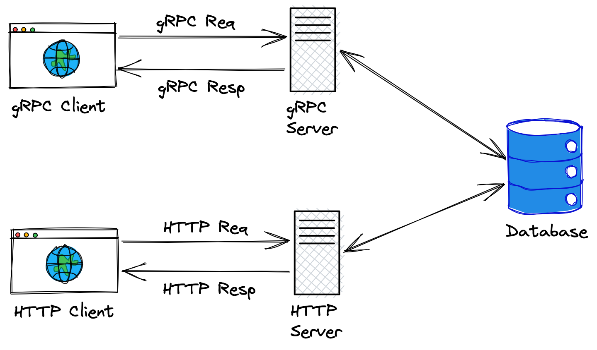

# golang-personal-finances

## Objective

This repo builds a service whose goal is to manage personal finances. It creates:
- a database
- a HTTP Server to manage expenses/incomes and its metadata (categories, cards)
- a gRPC Server to manage expenses/incomes and its metadata (categories, cards)

Here is a simple diagram that describes the project:

## Technologies used
- Protobuf 3
- gRPC
- Golang (using gin http framework)
- Postgres
- Docker

## How to run locally

1. On the project root folder run `make docker-up` - It builds the database and the gRPC / HTTP apps
2. After the environment is set up, you can test the HTTP Server using postman (**TODO**: add postman collection here)
3. You can also test the gRPC Server using this client https://github.com/rubengomes8/golang-personal-finances-client / or create your own - (**TODO**: need to update it)

